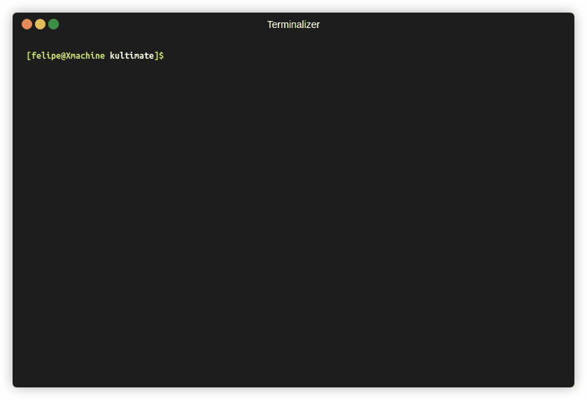

# Kultimate



Aplicación CLI Python para manejar archivos markdown como tableros Kanban.
Programado con [textual](https://textual.textualize.io/).

# Instalación

```sh
pip install kultimate
```

## Configuración

Trabajo en progreso

## Uso

|                     | Teclas para operar la aplicación              |
| ------------------- | --------------------------------------------- |
| j, flecha abajo     | ir a la tarea de abajo                        |
| k, flecha arriba    | ir a la tarea de arriba                       |
| l, flecha izquierda | ir a la columna de la derecha                 |
| h, flecha derecha   | ir a la columna de la izquierda               |
| J                   | Llevar la tarea hacia arriba                  |
| K                   | Llevar la tarea hacia abajo                   |
| L                   | Cambiar la tarea a la columna de la derecha   |
| H                   | Cambiar la tarea a la columna de la izquierda |
| s                   | Seleccionar un archivo para abrirlo           |
| o                   | Agregar tarea al final de la columna actual   |
| ctrl+l              | Mueve la tarea a la última columna            |
| ctrl+d              | Borra la tarea seleccionada                   |
| q                   | Salir de la aplicación                        |

## ToDo

- [ ] TODO: Rehacer la configuración de la aplicación.
- [ ] TODO: Si no existe directorio pedirlo.
- [ ] TODO: Hacer esqueleto para crear los nuevos archivos.
- [ ] TODO: Crear nuevo archivo.
- [ ] TODO: Agregar columnas.
- [X] DONE: Reducir el tamaño de la caja para capturar las tareas.
- [X] DONE: Editar tareas
- [X] DONE: Al mover las tareas entre columnas visualmente se ve bien, pero al
  grabar a disco se queda en todas las columnas por donde pasa.
- [X] DONE: Grabar a disco.
- [X] DONE: Agregar tareas.
- [X] DONE: preguntar antes de borrar la tarea.
- [X] DONE: Borrar tareas.
- [X] DONE: Enviar tareas a la última columna.
- Operaciones en archivo.
  - [X] DONE: Convertir html a markdown al grabar.
  - [X] DONE: Grabar el archivo a disco.

## Quizás

- [ ] TODO: Mover columnas.
- [ ] TODO: Duplicar tareas.
- [ ] TODO: Agregar sub tareas.
- [ ] TODO: Crear un color nuevo para la última columna.
- [ ] TODO: Seleccionar tareas con click del ratón.
- [X] DONE: Cambiar Task al widget Input.
- [X] DONE: Filtrar los archivos por extensión..
- [X] DONE: de Markdown a html.
- [X] DONE: del html extraer la info con beautifulsoup.
- [X] DONE: Que aparezca el nombre del archivo en la cabecera de la aplicación.
- [X] DONE: Crear las columnas al cambiar de archivo usar mount y remove.
- [X] DONE: ¿Por qué se "dispara" el scroll horizontal, si no estoy agregando.
  nuevos elementos? R: Cada que se cargaba un nuevo archivo se montaba un.
  StageContainer por cada columna.
- [X] DONE: Al cambiar a una columna sin tareas se truena el programa.
- [X] DONE: Primero debo corregir lo del foco al cargar el archivo.
- [X] DONE: No funciona al presionar la primera H, hasta la segunda. En realidad no
  funciona la primera tecla.
- [X] DONE: En general no detecta la primera letra que se presiona al seleccionar
  un archivo.
- [X] DONE: al presionar primero la tecla k (go_to_up) no se mueve correctamente a
  la última tarea.
- [X] DONE: al mover una tarea hacia la primer columna, si se tiene que hacer
  scroll, una vez se hace correctamente, y otra no.
